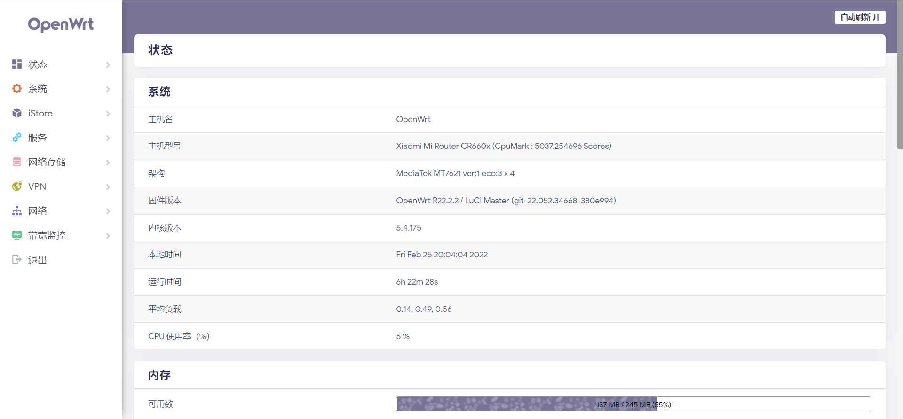

# OpenWrt-CR660X
自编译适用于小米 CR660X 型号的 OpenWrt 固件
由 Github Action 所构建的固件请前往 [此处](https://github.com/AllsVoid/lede/actions) 寻找
### Notion！
本人在使用 OpenClash 的时候会出现爆 内存/CPU 的情况，故替换为 bypass/passwall

> 由于 CR6608 不带有 USB 口，因此没有编译与 USB 有关的内容

路由管理页面 **192.168.30.1**

## 主题
- Argonne
- Edge

## 功能
- OpenClash
- iStore 应用商店
- iKoolProxy 去广告
- ServerChan 微信推送
- 解锁网易云灰色歌曲
- DDNS (支持阿里云|Cloudflare)
- WiFi 计划
- KMS 服务
- UU 加速器
- Wol 网络唤醒
- Docker
- Rclone
- ZeroTier
